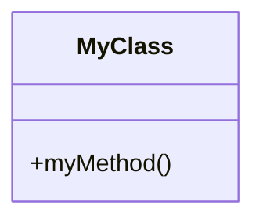
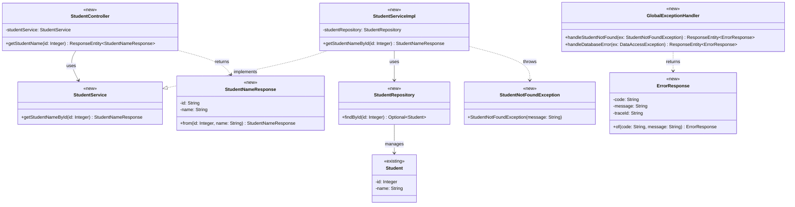
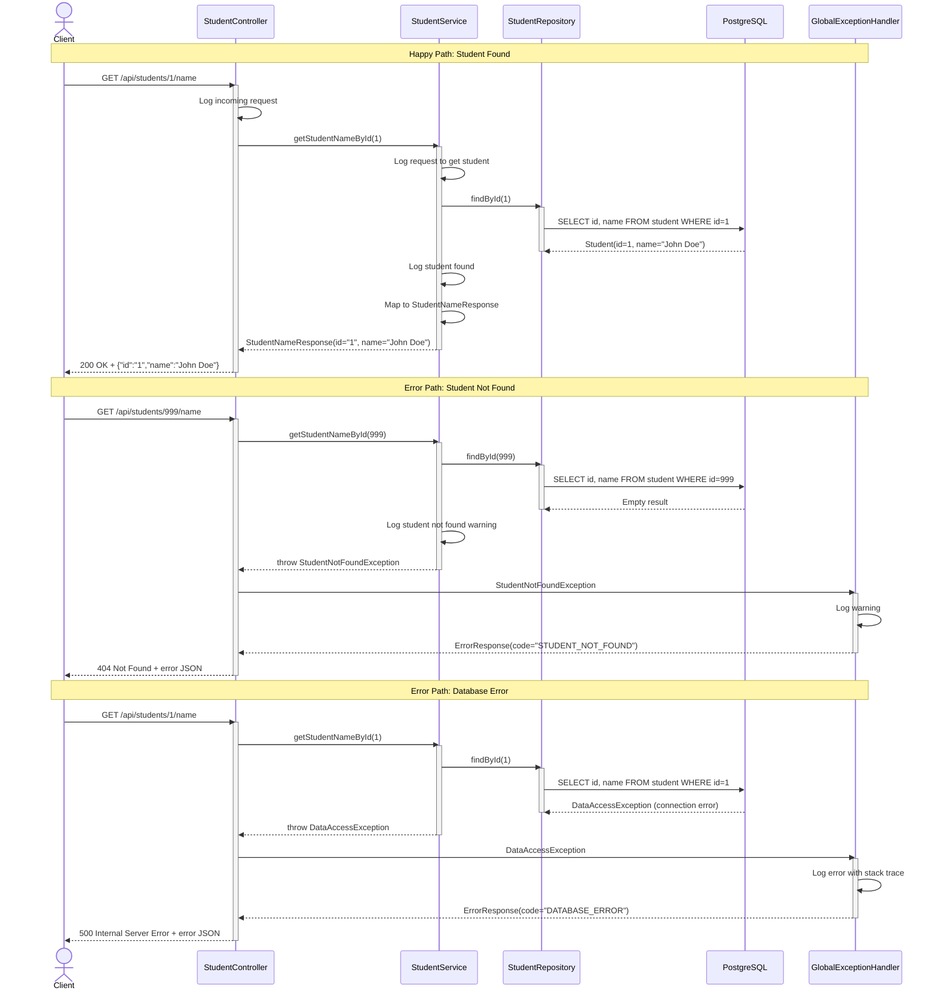
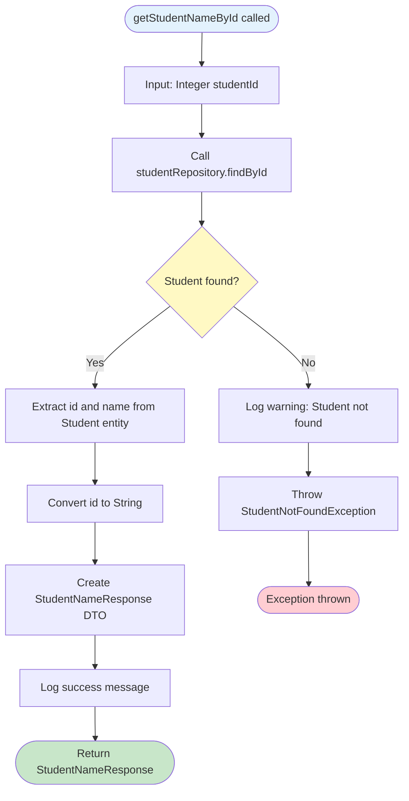
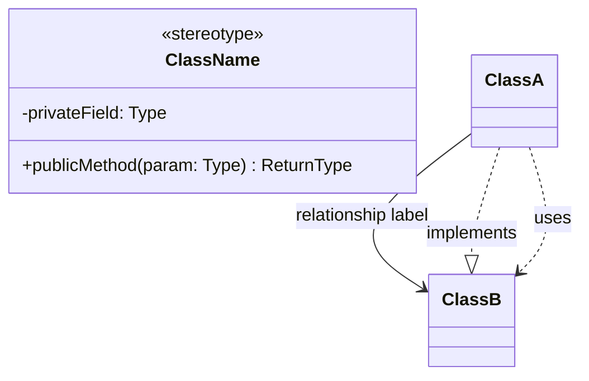
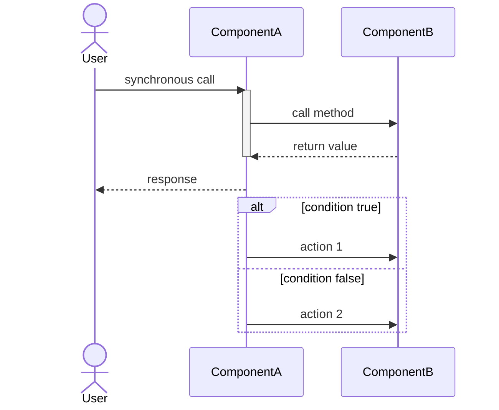
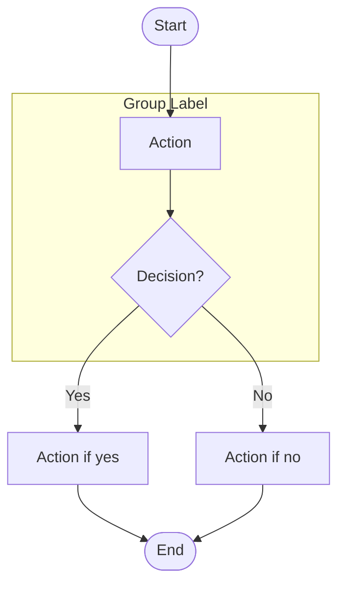
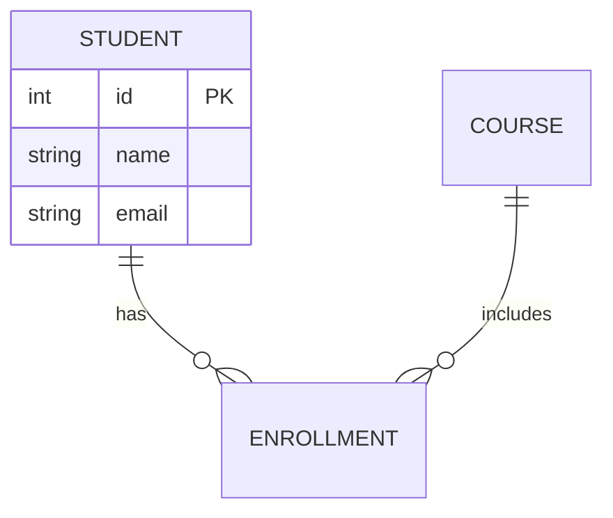
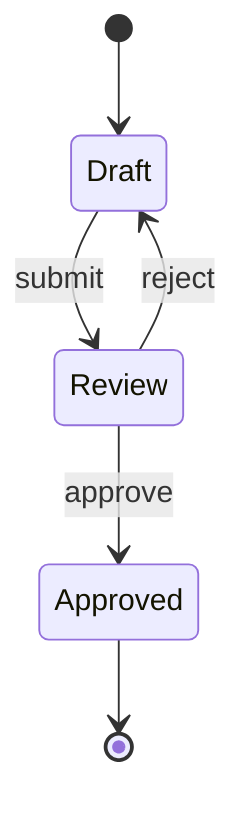
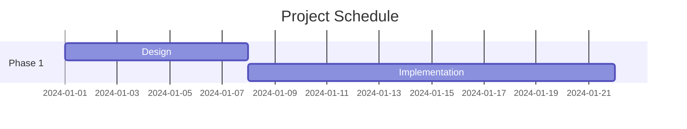

# Mermaid Diagram Conventions

This document defines the standard conventions for creating Mermaid diagrams in technical design documents.

---

## Theme and Styling

All Mermaid diagrams use the **default theme** - no custom configuration is required.

**How to include Mermaid diagrams in markdown:**

````markdown

````

**Why Mermaid default theme:**
- Clean, professional appearance out of the box
- No configuration overhead
- Consistent rendering across all platforms (GitHub, GitLab, etc.)
- Widely tested and maintained

---

## Class Diagram Conventions

### Rules:
- Use `<<new>>` stereotype for new classes being created
- Use `<<modified>>` stereotype for existing classes being modified
- Use `<<existing>>` stereotype for existing classes referenced without changes
- Show only relevant methods (not getters/setters unless important to design)
- Include key annotations in notes or class documentation
- Show relationships clearly: inheritance, composition, dependencies

### Example Class Diagram:



**Key Points:**
- Stereotypes (`<<new>>`, `<<modified>>`, `<<existing>>`) make change impact clear
- Use `<<interface>>` stereotype for Java interfaces
- Relationships use descriptive labels ("uses", "manages", "implements", "returns", "throws")
- Private fields use `-`, public methods use `+`
- Return types use tilde notation: `Optional~Student~`, `ResponseEntity~ErrorResponse~`
- Solid arrows (`-->`) for associations/dependencies
- Dotted arrows (`..>`) for usage/returns
- Dotted arrows with pipe (`..|>`) for implements/extends

---

## Sequence Diagram Conventions

### Rules:
- Show full request lifecycle from client to database
- Include HTTP status codes in responses (200 OK, 404 Not Found, etc.)
- Show database queries explicitly with SQL or method names
- Include error handling paths using `alt`/`else` blocks
- Label each interaction with method names and parameters
- Use `activate`/`deactivate` to show object lifetimes
- Use `participant` with aliases for readable names

### Example Sequence Diagram:



**Key Points:**
- Shows complete request flow including database interaction
- Uses `Note over` to separate scenarios (Happy Path, Error Paths)
- Uses `activate`/`deactivate` blocks to show when components are active
- HTTP methods and status codes are explicitly shown
- Database queries are documented (SQL or method names)
- Multiple error paths illustrated with `alt`/`else` blocks (or separate note sections)
- `actor` keyword for external clients
- `participant` with aliases (`Ctrl as StudentController`) for readability
- Solid arrows (`->>`) for synchronous calls
- Dotted return arrows (`-->>`) for responses

---

## Flowchart Conventions (Activity Diagrams)

### Rules:
- **Focus on Service Layer only** - Show business logic within a single service method
- Start with rounded box showing method name: `([methodName called])`
- End with rounded boxes for outcomes: `([Return result])`, `([Exception thrown])`
- Use diamond shapes for business decisions: `{User exists?}`, `{Payment valid?}`
- Show error handling paths clearly (leading to exception nodes)
- Keep focused on one service method's logic at a time
- Use clear labels on decision branches: `|Yes|`, `|No|`, `|Valid|`, `|Invalid|`
- Include: Repository calls, data transformations, validations, business rules
- Exclude: Controller logic, HTTP details, request/response mapping (shown in Sequence Diagram)

### Example Flowchart:

**Focus: Service Layer method `getStudentNameById()`**



**Key Points:**
- **Service Layer focus** - Shows only business logic within one service method
- **Start node** - Method name (e.g., "getStudentNameById called")
- **End nodes** - Return value or exception thrown
- **Decision point** - Business logic decision (Student found?)
- **Activities included** - Repository calls, data transformations, validations, logging
- **Activities excluded** - Controller logic, HTTP details, response wrapping
- `flowchart TD` specifies top-down direction (can also use `LR` for left-right)
- Diamond shapes (`{...}`) for business decisions with clear yes/no branches
- Rounded boxes (`([...])`) for start/return/exception nodes
- Rectangular boxes (`[...]`) for activities and transformations
- Arrow labels use pipe notation: `-->|Yes|`, `-->|No|`
- Multiple end nodes allowed (Return for success, Error for exceptions)
- Optional styling to highlight start (blue), success (green), errors (red), decisions (yellow)
- Keeps diagram simple and focused (9 nodes vs 20+ in full-layer approach)

---

## General Best Practices

### Do:
- ✅ Use Mermaid's default theme for consistency
- ✅ Include both happy paths and error handling
- ✅ Label relationships and interactions clearly
- ✅ Show stereotypes to indicate new vs modified components
- ✅ Keep diagrams focused (one concern per diagram)
- ✅ Use descriptive names for participants and activities
- ✅ Test diagram rendering in markdown preview

### Don't:
- ❌ Create overly complex diagrams (split into multiple if needed)
- ❌ Omit error handling paths
- ❌ Include implementation details (like private helper methods)
- ❌ Use abbreviations without explanation
- ❌ Forget to show database or external service interactions
- ❌ Mix different diagram types in a single code block

---

## When to Use Each Diagram Type

| Diagram Type | Use Case | What to Show |
|--------------|----------|--------------|
| **Class Diagram** | Component structure and relationships | Classes, interfaces, relationships, key methods, stereotypes |
| **Sequence Diagram** | Request/response flows and interactions | Full lifecycle, HTTP calls, database queries, error paths, activation bars |
| **Flowchart** | Complex business logic or workflows | Decision points, conditions, multi-step processes, layer partitions, error paths |

---

## Mermaid Syntax Quick Reference

### Class Diagram Syntax


### Sequence Diagram Syntax


### Flowchart Syntax


---

## Extension Points

Future diagram types that can be added to this skill:

### Entity-Relationship Diagrams (ERD)


### State Diagrams


### Gantt Charts


---

## Troubleshooting

### Common Issues:

1. **Diagram not rendering**: Check for syntax errors (missing arrows, invalid keywords)
2. **Stereotype not showing**: Ensure `<<stereotype>>` is on its own line inside class definition
3. **Arrow direction wrong**: Use `->>` for forward, `-->>` for return, `-->` for association
4. **Subgraph overlapping**: Ensure nodes are properly grouped within subgraph boundaries
5. **Special characters**: Use quotes for labels with special characters: `A["Label with (parentheses)"]`

### Testing Your Diagrams:

- Use [Mermaid Live Editor](https://mermaid.live/) to test syntax
- View in GitHub/GitLab markdown preview
- Check rendering in your IDE's markdown preview
- Validate all three diagram types (class, sequence, flowchart) before finalizing design

---

**These conventions ensure consistency across all technical design documents and make diagrams easy to read, maintain, and render natively in modern development platforms.**
